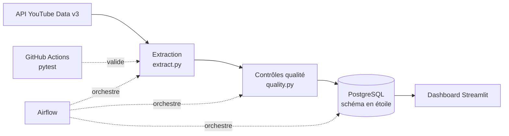

# YouTube Data Pipeline — SIG, géomatique, IA & data


Pipeline de _data engineering_ qui collecte, historise et visualise des données
de vidéos YouTube portant sur la **géomatique / SIG**, l'**intelligence artificielle**
et la **data**, afin d'analyser l'évolution de la production de contenu
**avant et après le lancement de ChatGPT** (30 novembre 2022).

Le projet couvre toute la chaîne : extraction depuis l'API, contrôles qualité,
chargement en base, orchestration planifiée, visualisation interactive et
intégration continue.

---

## Question analytique

ChatGPT a-t-il provoqué une accélération mesurable de la production de vidéos
sur l'IA et la data ? Et comment se compare cette dynamique à celle d'un domaine
plus stable comme la géomatique ? Le pipeline permet de répondre en comparant
les volumes de publication par thème, période et année.

---

## Architecture



Deux flux orchestrés par Airflow :

- **Découverte** (hebdomadaire) — cherche de nouvelles vidéos via `search.list`
  (coûteux en quota), récupère leurs détails et alimente la base.
- **Snapshot** (quotidien) — relit les vidéos déjà connues et enregistre leurs
  métriques du jour via `videos.list` (quasi gratuit). C'est lui qui construit
  l'historique que l'API ne fournit pas.

---

## Stack technique

| Composant         | Technologie                   |
| ----------------- | ----------------------------- |
| Extraction        | Python, YouTube Data API v3   |
| Qualité           | Contrôles maison + pytest     |
| Base de données   | PostgreSQL 16 (Docker)        |
| Accès BDD         | psycopg (v3)                  |
| Orchestration     | Apache Airflow 3.2.2 (Docker) |
| Visualisation     | Streamlit + Plotly            |
| Intégration cont. | GitHub Actions                |

---

## Modèle de données (schéma en étoile)

| Table              | Rôle                          | Colonnes principales                                                                                                     |
| ------------------ | ----------------------------- | ------------------------------------------------------------------------------------------------------------------------ |
| `dim_video`        | Dimension — une ligne / vidéo | `video_id` (PK), `title`, `channel_title`, `published_at`, `duration_sec`, `tags`…                                       |
| `fact_video_stats` | Faits — un snapshot / jour    | `video_id` (FK), `snapshot_date`, `view_count`, `like_count`, `comment_count` ; **unique** (`video_id`, `snapshot_date`) |
| `video_topic`      | Pont vidéo ↔ thème            | `video_id` (FK), `topic` ∈ {GEOMATIQUE, IA, DATA}                                                                        |

Le couple unique `(video_id, snapshot_date)` rend les insertions **idempotentes** :
relancer un snapshot le même jour ne crée pas de doublon.

---

## Structure du projet

```
Youtube_project/
├── .github/workflows/ci.yml      # Intégration continue (pytest)
├── .streamlit/config.toml        # Thème du dashboard
├── airflow/
│   ├── dags/
│   │   ├── youtube_discovery.py  # DAG hebdomadaire
│   │   └── youtube_snapshot.py   # DAG quotidien
│   └── docker-compose.yaml       # Stack Airflow
├── sql/init/01_schema.sql        # Création des tables (au 1er démarrage)
├── tests/                        # Suite pytest (27 tests)
├── config.py                     # Paramètres (lus depuis .env)
├── parsers.py                    # Conversions (durées ISO 8601, entiers)
├── youtube_client.py             # Appels API (search, videos)
├── extract.py                    # Orchestration de l'extraction
├── transform.py                  # Mise en forme des lignes à charger
├── quality.py                    # Contrôles qualité modulaires
├── load.py                       # Chargement PostgreSQL (upsert / idempotent)
├── dashboard.py                  # Dashboard Streamlit
├── docker-compose.yml            # PostgreSQL
├── requirements.txt
├── .env.example                  # Modèle de configuration (sans secret)
└── README.md
```

---

## Installation

### Prérequis

- Docker Desktop
- Python 3.12+
- Une clé API **YouTube Data API v3** (console Google Cloud)

### Mise en place

```bash
# 1. Cloner le dépôt
git clone https://github.com/TON_USER/TON_REPO.git
cd TON_REPO

# 2. Environnement virtuel
python -m venv youtube_env
source youtube_env/bin/activate      # Windows : .\youtube_env\Scripts\Activate.ps1

# 3. Dépendances
pip install -r requirements.txt

# 4. Configuration : copier le modèle et renseigner ses valeurs
cp .env.example .env                 # puis éditer .env
```

Variables attendues dans `.env` :

```
YOUTUBE_API_KEY=ta_cle_api
POSTGRES_USER=youtube
POSTGRES_PASSWORD=ton_mot_de_passe
POSTGRES_DB=youtube_db
DB_HOST=localhost
DB_PORT=5433
```

> Le `.env` contient des secrets : il est ignoré par Git et ne doit **jamais**
> être poussé.

### Lancer la base et le pipeline

```bash
# Démarrer PostgreSQL (le schéma se crée tout seul au premier lancement)
docker compose up -d

# Lancer le pipeline une fois (extraction + chargement)
python extract.py
python load.py

# Vérifier la qualité des tests
pytest -v
```

---

## Orchestration avec Airflow

```bash
cd airflow
docker compose up -d
```

Interface disponible sur **http://localhost:8080**. Active les deux DAG
(`youtube_discovery`, `youtube_snapshot`) avec leur interrupteur — ils sont en
pause à la création. Le snapshot quotidien peut être déclenché manuellement pour
amorcer l'historique ; la découverte tourne d'elle-même chaque semaine (évite de
la déclencher à la main pour ne pas consommer le quota).

---

## Dashboard

```bash
streamlit run dashboard.py
```

Ouvre **http://localhost:8501**. Trois onglets : _Vue d'ensemble_ (production
avant/après ChatGPT, par année, par thème), _Par chaîne_ (statistiques d'une
chaîne sélectionnée) et _Par vidéo_ (métriques détaillées et historique des
snapshots d'une vidéo).

---

## Tests & intégration continue

La suite `pytest` couvre les parsers, la transformation et les contrôles qualité
avec des données factices — aucun accès réseau ni base requis. À chaque `git push`,
**GitHub Actions** réinstalle les dépendances et relance les tests
(`.github/workflows/ci.yml`).

```bash
pytest -v
```

---

## Note méthodologique

Les statistiques renvoyées par l'API (vues, likes, commentaires) sont des valeurs
**à l'instant présent**, pas des séries historiques : une vidéo ancienne a eu plus
de temps pour accumuler des vues. Le **volume de production** (nombre de vidéos par
date de publication) est donc l'indicateur le plus fiable pour l'analyse avant/après.
Pour les vues, la **médiane** est préférée à la moyenne (quelques vidéos virales
faussent la moyenne), et le dashboard l'indique explicitement. L'historisation par
snapshots quotidiens permet, à terme, de reconstruire l'évolution réelle des
métriques que l'API ne stocke pas.

## Auteur

Projet personnel de data engineering — _(ADA AYA LAOUALI / INGENIEUR DATA SIG)_.
